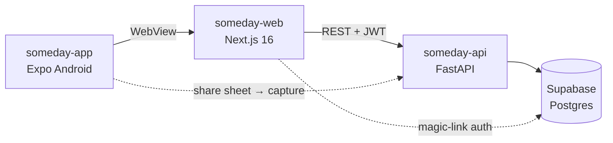

<div align="center">


# Someday

**For all the things you'll do together someday.**

A shared someday-list for small circles of friends — save the films, places,
restaurants and trips you keep saying *"we should do that"* about, then let the
app decide what you're actually doing tonight.

</div>

## What it does

- **Circles** — a private space for you and the people you make plans with: movie
  nights, the trip group, your best friend.
- **Save anything** — links, places, films, books, conversations to have. Eight
  categories: watch · eat · visit · read · play · trip · talk · other. Shared
  links unfurl with titles and thumbnails automatically.
- **React & boost** — tap the heart when you're interested; boost to nudge the
  group. When two of you want the same thing it lands on the Shortlist.
- **Payoff** — the answer to "what are we doing today?". *Smart-pick* scores
  ideas by mutual interest, age and boosts; *spin* hands the decision to fate.
- **Lifecycle** — ideas move saved → interested → planned → done, so the list
  stays a plan, not a graveyard.
- **Memories** — when marking something done, add a note and photos. A little
  record of actually doing it.
- **Notifications** — in-app activity feed for saves, reactions, and boosts
  across your circles; web push so you don't miss anything.
- **First-login tour** — new members get a quick spotlight tour; when features
  ship, returning users get a mini-tour of just what's new.

## How it's put together



| Directory | What | Stack | Runs on |
|---|---|---|---|
| [`someday-api/`](someday-api) | REST API | FastAPI · SQLAlchemy (raw SQL) · Supabase Postgres | Cloud Run |
| [`someday-web/`](someday-web) | The app UI | Next.js 16 · React 19 · Tailwind 4 | Vercel |
| [`someday-app/`](someday-app) | Android wrapper | Expo · React Native WebView | APK via GitHub Releases |

The Android app is a thin native shell around the web app: it shares the
Supabase session with the WebView, adds share-sheet capture (share a link from
any app straight into a circle) and updates itself by checking GitHub Releases
for a newer APK.

Auth is Supabase magic-link OTP end to end — the API verifies Supabase JWTs via
JWKS and never sees a password.

## Getting started

### Prerequisites

- Python 3.12+, Node 20+
- A [Supabase](https://supabase.com) project (Postgres + auth)
- [Supabase CLI](https://supabase.com/docs/guides/cli) for migrations

### 1. API

```bash
cd someday-api
python -m venv .venv && source .venv/bin/activate
pip install -r requirements.txt
cp .env.example .env.dev        # fill in Supabase URL, anon key, DATABASE_URL
supabase db push --db-url "$DATABASE_URL"   # apply migrations
python run.py                   # http://localhost:8000
```

### 2. Web

```bash
cd someday-web
npm install
# .env.local needs: NEXT_PUBLIC_SUPABASE_URL, NEXT_PUBLIC_SUPABASE_ANON_KEY,
#                   NEXT_PUBLIC_API_URL (http://localhost:8000)
npm run dev                     # http://localhost:3000
```

### 3. Android app (optional)

```bash
cd someday-app
npm install
npx expo start                  # or: eas build -p android
```

> [!NOTE]
> `APP_ENV` selects the API environment (`dev` is the default; `production`
> reads `.env.production`). Dev and prod use separate Supabase projects.

## Testing

```bash
# API — route + logic tests
cd someday-api && .venv/bin/pytest

# API — smoke test against a running instance
python smoke_test.py

# Web — screenshot/console smoke across screens
cd someday-web && node ui-test.mjs

# Web — onboarding tour behaviour (stubs the API, needs `npm run dev` on :3001)
node tour-test.mjs
```

## Deploying

- **API** → GCP Cloud Run (`asia-south1`), auto-deployed by Cloud Build on
  pushes to `main` that touch `someday-api/**` (`cloudbuild-production.yaml`).
- **Web** → Vercel, deployed from `main`.
- **Android** → `eas build -p android`, attach the APK to a GitHub Release
  tagged `vX.Y.Z`; installed apps discover the release and self-update.
- **Database** → plain SQL migrations in `someday-api/supabase/migrations/`,
  applied with `supabase db push`. Soft deletes only — rows are never deleted.

> [!IMPORTANT]
> `main` is protected: every change lands through a feature branch and PR,
> merged with a merge commit (never rebased).

## Conventions

The repo is agent-friendly: [`CLAUDE.md`](CLAUDE.md) defines the backend
layering (router → handler → module helper/queries), logging rules and SQL
conventions, and [`docs/style-guide.md`](docs/style-guide.md) is the single
source of truth for the design system — tokens, glass surfaces, the one
button gradient, and the sprite-icon system.
